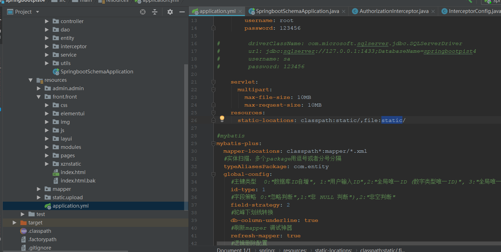
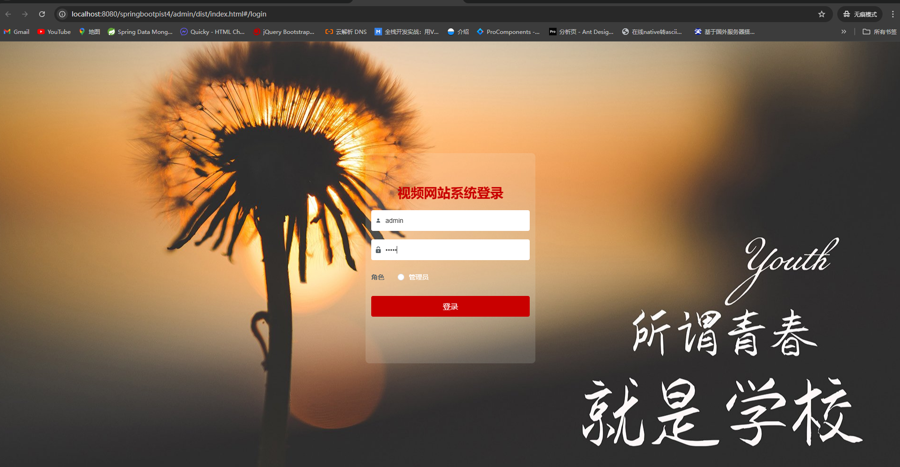

# 一、系统说明

基于springboot+vue+elementui开发的视频网站系统,系统功能齐全, 代码简洁易懂，适合小白学编程。

# 二、系统架构

######      前端：vue| elementui

######      后端：springboot | mybatis 

######      环境：jdk1.8+ | mysql8.0 | maven

# 三、代码及数据库

# 四、相关功能介绍

#### 1).客户端

###### 1.登录

###### 2.注册

###### 3.首页

###### 4.视频分享

5.视频排名

###### 6.交流论坛

###### 7.留言反馈

###### 8.个人中心

###### 9.个人中心->我的服务

###### 10.个人中心->我的发布

###### 11.个人中心->视频分享

###### 2).管理端

###### 1.登录

2.个人中心->修改密码

###### 3.用户管理

包含:用户新增、修改、删除

###### 4.视频分享管理

包含宠物:详情、删除、查看评论功能

###### 5.视频排名管理

包含:详情、删除、修改、查看评论

###### 6.公告管理

包含:详情、删除、查询、新增功能

###### 7.视频类型管理

包含:详情、删除、修改、新增功能

###### 8.交流论坛

包含:详情、新增、删帖

###### 9.留言板管理

包含:详情、删除、查询、修改功能

###### 10.轮播图管理

######
